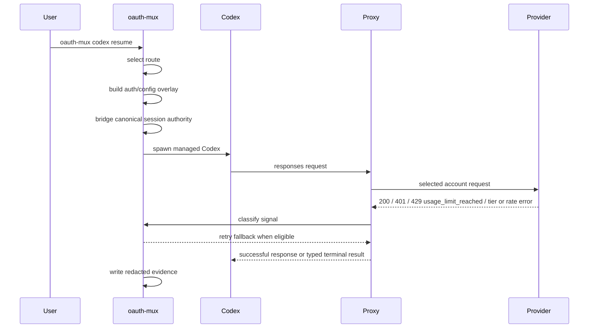

# oauth-mux

`oauth-mux` is OAuth/account multiplexing for professional AI harnesses and
autonomous agents.

Developers and agents now operate across personal, work, team, subscription,
API-key, and service identities. Most CLIs still expose a brittle single-account
path: one local auth store, one active subscription, one opaque 401/429 failure
surface. `oauth-mux` puts a broker in front of that path so a harness session can
stay usable when auth, quota, tier, or local runtime state changes.

The product bar is intentionally narrow and hard:

> The user runs `oauth-mux <harness>` such as `oauth-mux codex`. The harness
> behaves like the real one. The active subscription account exhausts quota.
> Another credited account is substituted in place. The harness process is not
> restarted. The user is not prompted.

Restart, supervised relaunch, route warming, and `prepared_fallback` are
diagnostic infrastructure. They are not product success.

## Current Truth

Public install lanes are versioned by channel. `0.1.12` is the current verified
public release for GitHub Release, curl installer, deb/rpm assets, Homebrew,
user-local dogfood, and the Home Manager source lane. It carries the Codex
0.132 SQLite resume authority fix, the Codex capture-review proxy metadata
gate, and the provider-namespace resume picker fix from PR #295. npm still
reports `0.1.9` until CI npm auth is repaired. Homebrew remains binary-only by
default: `brew install jesssullivan/omux/oauth-mux` installs `oauth-mux` and
must not install or link a managed `codex` shim.

What works today:

- Managed Codex launch and resume through `oauth-mux codex` and
  `oauth-mux codex resume`.
- Current source/user-local dogfood and the npm wrapper lane can include a
  managed `codex` shim, so a bare `codex` command is managed only when PATH
  resolves that shim. Admin commands such as `codex login` and
  `codex --version` must pass through to native Codex. Direct native Codex
  binaries and already-running native sessions are not globally protected.
- Native Codex chooser/session authority bridge, including canonical
  `state_5.sqlite*` and `logs_2.sqlite*` when present, with managed Codex using
  Codex's built-in `openai` provider namespace so the native and managed resume
  pickers enumerate the same session rows. Managed resume also reports
  canonical `state_5.sqlite` lock contention before child spawn instead of
  forking or bypassing Codex's session authority.
- Root-partitioned Codex config passthrough for user settings such as
  `[features]`, legacy `experimental_*`, MCP servers, approval/sandbox policy,
  profiles, model defaults, and non-managed provider definitions.
- Lazy account refresh at credential materialization or explicit repair time;
  managed launch reports `pre_spawn_network_refresh:false`.
- Managed Codex launch/resume auto-revalidates expired Codex quota/rate windows
  under the Codex stay-afloat policy before route election. Interactive login
  remains user-mediated.
- Live managed Codex quota handoff for installed `oauth-mux codex resume`, with
  the strongest preserved proof in
  `docs/evidence/codex-engineered-quota-handoff-20260509/`.
- Redacted JSON diagnostics and opt-in trace JSONL for agents and operators.

Still research or open:

- Same-thread provider semantic continuity across account boundaries.
- Mid-turn streaming recovery.
- Unmanaged bare-`codex` daemon hot-swap.
- Non-Codex provider stay-afloat proof.
- Long-window soak and negative permutation cassette coverage.
- Cross-process serialization of single-use OAuth refresh-token rotation (see
  "Known failure" below).

## Known failure: concurrent Codex sessions & rotating OAuth refresh tokens

If you run many parallel Codex sessions against the same ChatGPT/Codex account and
see any of:

```
Your access token could not be refreshed because your refresh token was already used. Please log out and sign in again.
token_revoked
HTTP 401  https://chatgpt.com/backend-api/codex/responses
https://chatgpt.com/backend-api/codex/responses/compact
already used. Please log out and sign in again.
```

you are hitting single-use **rotating** OAuth refresh tokens under concurrency.
Each successful refresh invalidates the token it consumed; upstream Codex guards
refresh only in-process plus an unlocked file backend, so independent processes
race the refresh — the first rotates, every other refresher gets `token_revoked`
(upstream class `openai/codex#10332`; oauth-mux specs track it as
`openai/codex#9634`). `oauth-mux` today runs **per-session in-process proxies with
no shared daemon** (see "There is no hidden daemon dependency for the current Codex
path." above), and the broker's read → refresh → write path holds no cross-process
lock, so even brokered multi-session launches can still double-spend one rotating
token. The error URL is `chatgpt.com` because the broker proxies upstream to
ChatGPT — it does **not** prove direct/native mode; the *refresh* POST that rotates
the token actually targets `auth.openai.com/oauth/token`.

This is an `oauth-mux`-owned serialization defect, not just a Codex bug: it hampers
any agent-laced harness workflow, including a single harness fanning out sessions.
The remediation is (1) a cross-process, per-`provider:account` refresh lock so N
concurrent refreshers collapse to one rotation plus N-1 no-op re-reads, and (2) an
adapter-agnostic serial re-enrollment / re-login surface so a revoked account is
re-authed exactly once across sessions. Full root cause + repro:
`docs/incidents/2026-05-31-codex-refresh-token-race.md`; design + acceptance plan:
`docs/spec/codex-refresh-serialization-contract-2026-05-31.md`.

The proposed acceptance gate (to be implemented with the fix) is a deterministic,
no-spend, failing-then-passing proof: a unit test (`zig build test`) that spawns N
concurrent refreshers against a stubbed OAuth **token endpoint** and asserts one
POST / zero `token_revoked` once serialized, plus a cross-process smoke
(`just smoke-codex-refresh-race`) pointing two sessions at one shared account.

## Lifecycle

```mermaid
flowchart LR
    install["Install"] --> init["init"]
    init --> enroll["Enroll accounts"]
    enroll --> diagnose["Local diagnostics"]
    diagnose --> route["Route selection"]
    route --> launch["Managed harness launch"]
    launch --> signal["Provider signal observed"]
    signal --> decision["Broker decision"]
    decision --> materialize["Fallback materialization"]
    materialize --> status["Redacted status artifact"]
    status --> repair["Repair / revalidate loop"]
    repair --> diagnose
```





Route-state labels are stable public vocabulary:
`available`, `quota_exhausted`, `rate_limited`, `tier_insufficient`,
`auth_permanently_failed`, `credential_unavailable`, `revalidation_needed`, and
`not_afloat`.

See `docs/lifecycle.md` for the deeper lifecycle, agent control-plane, and claim
ladder diagrams.

## Install

Public install lanes:

```bash
npm install -g oauth-mux
# or
brew install jesssullivan/omux/oauth-mux
```

The Homebrew formula is intentionally binary-only. It should not change
`command -v codex`; use the explicit local, npm, Nix, or future opt-in package
shim lanes when testing managed bare-`codex` behavior.

Nix users can choose the binary-only package or the managed-shim package:

```bash
nix build .#oauth-mux
nix build .#withCodexShim
```

Home Manager users should import `inputs.oauth-mux.homeManagerModules.default`.
The module installs only `oauth-mux` by default; set
`programs.oauth-mux.codexShim.enable = true` to intentionally put the managed
`codex` shim on PATH. See `docs/home-manager.md`.

Unreleased source dogfood should keep provenance explicit:

```bash
just install-local-dogfood
which -a oauth-mux
which -a codex
oauth-mux version
oauth-mux version --json
oauth-mux codex preflight --profile codex-max --capability codex-max --json
```

If `which -a oauth-mux` resolves Homebrew before the user-local dogfood binary,
adjust PATH or invoke `./zig-out/bin/oauth-mux` directly for source-tree proof.

`version --json` prints the active executable path classification, SHA-256, and
compiled `build_id` under `runtime_identity`. Use it when public packages and
local dogfood have nearby version strings and you need machine-readable proof of
the exact binary that will run.

`codex preflight` prints the active `oauth-mux` path, all visible `oauth-mux`
and `codex` PATH candidates, whether active `codex` is the managed oauth-mux
shim, the first native Codex binary, and the `OMUX_CODEX_BIN` escape hatch. Use
that before debugging stale package or managed-versus-unmanaged Codex behavior.
It also reports redacted shell context, including whether `CODEX_HOME` is set,
whether it is an oauth-mux managed overlay, and whether inherited `OMUX_*`
managed-session variables are present.
If a shell refresh changes the result, start a fresh shell or use the shell's
native reload path. For example, fish cannot safely `source ~/.bashrc`; bash
syntax can fail partway through and leave a misleading mixed environment.
Its JSON separates `agent_safe_next_actions` from
`spend_confirmed_next_actions`; text output uses matching no-spend diagnostics
and spend-confirmed repair sections. The same JSON includes `repair_summary`,
a compact blocked-route rollup for agents that need to distinguish expired
quota-window revalidation, auth handoff, runtime repair, and wait-only states
without scraping per-route diagnostics.

On macOS, do not overwrite the old Mach-O in place. A direct `cp` over the
installed binary can leave stale taskgated/code-signing state on the old vnode
and produce an immediate `SIGKILL` / status `137`.

`just install-local-dogfood` stages the new binary in the install directory,
renames it into place, verifies the installed hash against
`./zig-out/bin/oauth-mux`, prints the installed version, and leaves the native
`codex` command unshadowed by default. Before replacing the binary, it refuses
when active managed `oauth-mux codex` sessions are visible and prints a redacted
parent/child PID and listener-port report. Re-run with
`OMUX_DOGFOOD_ALLOW_ACTIVE_SESSIONS=1` only after explicitly accepting that
already-running sessions keep their current process image.

Use `just install-local-dogfood-shim` or set
`OMUX_DOGFOOD_INSTALL_CODEX_SHIM=1` only when you intentionally want
`~/.local/bin/codex` to enter managed Codex sessions through oauth-mux. The shim
resolves the native upstream Codex executable, passes native admin commands
through, and enters `oauth-mux codex` for managed session commands. It refuses
to replace a non-oauth-mux `codex` already in that directory unless
`OMUX_DOGFOOD_REPLACE_CODEX=1` is set. Use `just uninstall-local-dogfood` to
remove the local dogfood binary and any oauth-mux-marked `codex` shim without
touching a native Codex executable. Public packages may carry a managed `codex`
shim, but installed behavior must still be proven with `version --json`,
`which -a codex`, and `codex preflight` when you need to distinguish a package
binary from a worktree dogfood binary.
The installer warns if the copied user-local binary is still shadowed by a
Homebrew or other PATH entry.

## Usage

Human first run:

```bash
oauth-mux init --codex-max
oauth-mux doctor
oauth-mux route explain --profile codex-max --capability codex-max
oauth-mux codex resume
```

If a route needs upstream auth, run the labeled handoff reported by
`route explain`, for example:

```bash
oauth-mux codex login-device max-3
```

Agent-safe inspection:

```bash
oauth-mux doctor runtime --profile codex-max --capability codex-max --json
oauth-mux accounts list --provider codex --json
oauth-mux route explain --profile codex-max --capability codex-max --json
oauth-mux repair-plan --profile codex-max --capability codex-max --json
oauth-mux codex preflight --profile codex-max --capability codex-max --json
oauth-mux codex status-latest --json
```

When shell, install, auth, and route-health state disagree, enable the redacted
trace sink:

```bash
OMUX_TRACE=1 \
OMUX_TRACE_FILE=/tmp/oauth-mux-trace.ndjson \
oauth-mux codex preflight --profile codex-max --capability codex-max --json
```

See `docs/tracing.md` for the trace schema and redaction contract.

Those inspection commands do not spend provider calls. In the current release,
managed Codex launch/resume and admitted stay-afloat execution may spend
provider calls only to revalidate expired Codex quota/rate windows before route
election. Live probes, broad revalidation, and non-Codex provider-spend paths
remain explicit.

## UX / DX / AX Contract

UX:

- The managed harness should feel native.
- There is no hidden daemon dependency for the current Codex path.
- Handoffs are labeled and user-mediated when upstream login is required.

DX:

```bash
just build
just test
just check-local
```

Use `just release-proof <version>` before any registry mutation. Direct
`zig build` is fine for iteration, but `just` is the operator entrypoint.

AX:

- JSON surfaces are redacted and account-label based.
- Trace events are opt-in and must not print token bytes, raw provider account
  ids, raw Codex session ids, or local auth/config file paths.
- Agents do not need token files or raw provider stores to choose a next action.
- Provider-spend behavior is policy-labeled; no-spend inspection surfaces stay
  separate from managed Codex auto-revalidation and live probes.
- Diagnostic output should include exact next-action commands.

## Proof

Keep the claim ladder tied to evidence:

- `docs/qa-handoff-matrix.md`: route states, handoff patterns, and current Codex
  truth.
- `docs/productionization-ledger.md`: UX/DX/AX stance, feature ledger,
  adapter strategy, daemon beta boundary, release posture, and tracker map.
- `docs/release-install-lanes.md`: public package lanes versus local dogfood
  lanes.
- `docs/dogfood-process-fanout.md`: no-spend agent process topology snapshots
  and cleanup rules for suspected helper fanout or RSS growth.
- `docs/lifecycle.md`: application lifecycle, managed Codex flow, agent-safe
  control plane, and claim levels.
- `docs/spec/in-agent-reauth-handoff-contract-2026-05-14.md`: agent/MCP
  contract for user-mediated reauth prompts, consent, and redaction.
- `docs/tracing.md`: opt-in trace schema, sink selection, and redaction rules.
- `docs/evidence/codex-engineered-quota-handoff-20260509/`: current headline
  managed Codex quota-handoff proof.

The product anchor is `docs/spec/broker-mcp-contract-2026-05-03.md`. The Codex
adapter contract is `docs/spec/codex-adapter-contract-2026-05-03.md`.
