# oauth-mux

OAuth and account multiplexing for professional AI harnesses and autonomous agents.

Developers and agents now work across personal, work, team, subscription, API-key,
and service identities, but most CLIs expose one auth store, one active
subscription, and one opaque 401/429 failure. `oauth-mux` puts a broker in front of
that path so a harness session stays usable when auth, quota, tier, or local
runtime state changes.

The product bar is narrow and hard:

> The user runs `oauth-mux <harness>` (e.g. `oauth-mux codex`). The harness behaves
> like the real one. The active account exhausts quota. Another credited account is
> substituted in place. The process is not restarted. The user is not prompted.

Restart, supervised relaunch, route warming, and `prepared_fallback` are diagnostic
infrastructure — not product success.

## Current release

`0.1.14` ("keepalive") is the current public release across the GitHub Release,
curl installer, deb/rpm, and Homebrew lanes. It adds **credential keepalive**:
`oauth-mux keepalive` proactively refreshes enrolled accounts at ~75% of token
lifetime, consent-gated per account (`allow_proactive_refresh`, default `false`) and
off by default, with shared-identity exclusion, identity dedupe before election, an
in-process refresh lock, launchd/systemd service-unit templates, and isolated-browser
Claude login helpers. `CHANGELOG.md` lists every change and the committed evidence
each claim is bound to. The npm lane is retired (registry frozen at `0.1.9`).

Homebrew is binary-only: `brew install jesssullivan/omux/oauth-mux` installs
`oauth-mux` and does not link a managed `codex` shim.

### What works today

- **Managed Codex** launch and resume (`oauth-mux codex`, `oauth-mux codex resume`)
  with a native resume chooser against the account's route-local persistent home.
  Management applies only when PATH resolves the oauth-mux shim; direct native
  `codex` binaries and already-running native sessions are not protected.
- **Route-local Codex session authority**: managed runs use the selected account
  home as `CODEX_HOME` and keep muxed state out of canonical `~/.codex`. Config is
  written fresh per launch and scrubbed on exit. Legacy canonical-bridge behavior is
  explicit opt-in (`shared_canonical`).
- **Credential keepalive** (`oauth-mux keepalive [--once]`) for opted-in accounts;
  accounts sharing an OAuth identity are refused (refresh-token-family protection).
  Service residency is operator-explicit (`just keepalive-service-install`; nothing
  auto-enables). Proven by committed `docs/evidence/keepalive-*` (refused-safely
  tick, 5-account admission/stability soak, rotation-under-loop for two accounts).
  Keepalive does not create capacity — quota windows reset on the provider's clock;
  model/quota-class keepalive is design-only
  (`docs/spec/model-quota-granularity-2026-07-03.md`).
- **Live Codex quota handoff** for `oauth-mux codex resume`; managed launch/resume
  auto-revalidates expired Codex quota/rate windows before route election.
  Interactive login stays user-mediated. Headline proof:
  `docs/evidence/codex-engineered-quota-handoff-20260509/`.
- **Redacted diagnostics**: JSON surfaces and opt-in trace JSONL for agents and
  operators, no token bytes or raw account/session ids.

### Still open

Non-Codex provider stay-afloat proof; live keepalive service-residency proof; the
2×Claude + 2×Codex golden-metric soak; same-thread cross-account continuity;
mid-turn streaming recovery; long-window soak and negative-permutation cassettes.

## Lifecycle

```mermaid
flowchart LR
    install["Install"] --> init["init"]
    init --> enroll["Enroll accounts"]
    enroll --> diagnose["Local diagnostics"]
    diagnose --> route["Route selection"]
    route --> launch["Managed harness launch"]
    launch --> signal["Provider signal observed"]
    signal --> decision["Broker decision"]
    decision --> materialize["Fallback materialization"]
    materialize --> status["Redacted status artifact"]
    status --> repair["Repair / revalidate loop"]
    repair --> diagnose
```



Route-state labels are stable public vocabulary: `available`, `quota_exhausted`,
`rate_limited`, `tier_insufficient`, `auth_permanently_failed`,
`credential_unavailable`, `revalidation_needed`, `not_afloat`. See
`docs/lifecycle.md` for the full lifecycle, agent control-plane, and claim ladder.

## Install

```bash
brew install jesssullivan/omux/oauth-mux     # binary-only; no managed codex shim
nix build .#oauth-mux                         # or .#withCodexShim for the managed shim
```

Home Manager: import `inputs.oauth-mux.homeManagerModules.default` (installs
`oauth-mux` only; set `programs.oauth-mux.codexShim.enable = true` for the shim). See
`docs/home-manager.md`.

Unreleased source dogfood:

```bash
just install-local-dogfood
oauth-mux version --json     # active path, SHA-256, and build_id under runtime_identity
```

`version --json` gives machine-readable proof of the exact binary that will run, and
`oauth-mux codex preflight --json` reports PATH candidates and managed-vs-native
Codex resolution. Provenance rules, PATH-shadow handling, the macOS
in-place-overwrite hazard, and the shim contract live in
`docs/release-install-lanes.md`.

## Usage

First run:

```bash
oauth-mux init --codex-max
oauth-mux doctor
oauth-mux route explain --profile codex-max --capability codex-max
oauth-mux codex resume
```

`oauth-mux codex` reads `defaults.profile`/`defaults.capability` and falls back to
the `codex-max` profile, so explicit flags are needed only for diagnostics or
scripted proof. If a route needs upstream auth, run the labeled handoff from
`route explain` (e.g. `oauth-mux codex login-device max-3`).

Agent-safe inspection (no provider spend):

```bash
oauth-mux doctor runtime --profile codex-max --capability codex-max --json
oauth-mux accounts list --provider codex --json
oauth-mux route explain --profile codex-max --capability codex-max --json
oauth-mux repair-plan --profile codex-max --capability codex-max --json
oauth-mux codex preflight --profile codex-max --capability codex-max --json
```

When shell, install, auth, and route-health state disagree, enable the redacted
trace sink (`OMUX_TRACE=1 OMUX_TRACE_FILE=…`; schema in `docs/tracing.md`). In the
current release, only managed Codex launch/resume and admitted stay-afloat execution
may spend provider calls — to revalidate expired Codex quota/rate windows before
route election. Inspection commands never spend.

## UX / DX / AX contract

- **UX** — the managed harness feels native; no hidden daemon dependency on the
  Codex path; handoffs are labeled and user-mediated when upstream login is needed.
- **AX** — JSON surfaces are redacted and account-label based; agents choose a next
  action without token files or raw stores; provider-spend behavior is
  policy-labeled and separated from diagnostic inspection; output includes exact
  next-action commands.
- **DX** — `just build | test | check | e2e` run on the remote proof runner
  (explicit `just remote-*` aliases exist). Local `*-local` recipes are debugging
  tools only, never the proof path. Run `just release-proof <version> [ref]` before
  any registry mutation.

## Proof

Claims stay tied to evidence:

- `CHANGELOG.md` — per-release changes and the evidence each claim is bound to.
- `docs/spec/broker-mcp-contract-2026-05-03.md` — the product anchor;
  `docs/spec/codex-adapter-contract-2026-05-03.md` — the Codex adapter contract.
- `docs/lifecycle.md` — lifecycle, managed Codex flow, agent control plane, claim levels.
- `docs/qa-handoff-matrix.md` — route states, handoff patterns, current Codex truth.
- `docs/release-install-lanes.md` — public package lanes vs local dogfood provenance.
- `docs/productionization-ledger.md` — UX/DX/AX stance, feature ledger, release posture.
- `docs/tracing.md` — opt-in trace schema and redaction rules.
- `docs/evidence/` — committed proof runs (Codex quota handoff; keepalive tick, soak, rotation).
