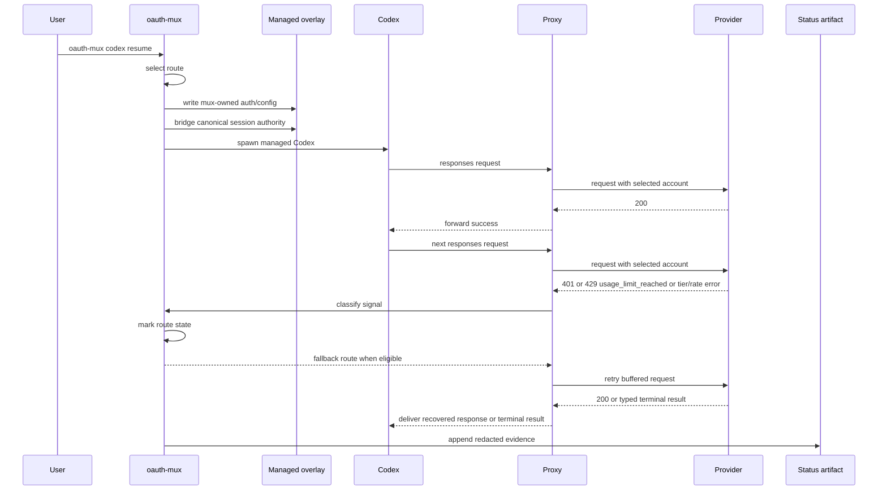
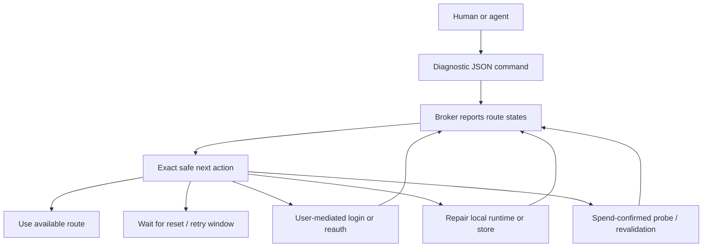
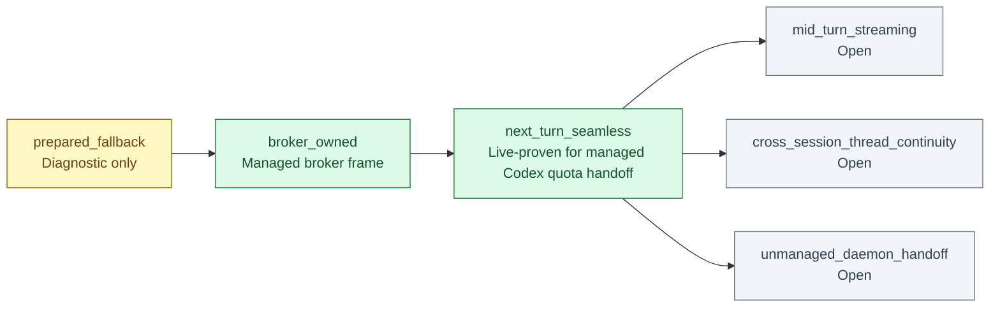

# oauth-mux Lifecycle

Updated: 2026-05-10

This page expands the lifecycle and claim diagrams kept short in the README. It
is subordinate to `docs/spec/broker-mcp-contract-2026-05-03.md` and
`docs/spec/codex-adapter-contract-2026-05-03.md`.

## Application Lifecycle

```mermaid
flowchart LR
    install["Install oauth-mux"] --> init["Initialize profile"]
    init --> enroll["Enroll or label accounts"]
    enroll --> diagnostics["Local diagnostics"]
    diagnostics --> route["Route selection"]
    route --> launch["Managed harness launch"]
    launch --> observe["Provider signal observed"]
    observe --> decide["Broker decision"]
    decide --> fallback["Fallback / materialization"]
    fallback --> artifact["Redacted status artifact"]
    artifact --> repair["Repair / revalidate loop"]
    repair --> diagnostics

    diagnostics --> noSpend["Diagnostic JSON surfaces"]
    repair --> userHandoff["User-mediated login / reauth"]
    repair --> liveProbe["Spend-confirmed live probe"]
```



The lifecycle separates diagnostic inspection from provider-spend operations.
Agents can inspect route and runtime state without reading token files or
triggering provider calls. Login, reauth, and live probes remain explicit human
or operator actions.

## Managed Codex Session Flow



The current live-proven Codex claim is managed quota handoff for installed
`oauth-mux codex resume`. The proof requires a provider-originated
`usage_limit_reached` response, route marking, a same-turn retry on a distinct
fallback account, and fallback `200` before Codex sees the 429.

## Agent-Safe Control Plane



Diagnostic commands:

```bash
oauth-mux doctor runtime --profile codex-max --capability codex-max --json
oauth-mux accounts list --provider codex --json
oauth-mux route explain --profile codex-max --capability codex-max --json
oauth-mux repair-plan --profile codex-max --capability codex-max --json
oauth-mux codex status-latest --json
```

Spend-confirmed commands and upstream login commands are separate by design.
Agents should present those commands to the user or operator; they should not
infer token paths, copy provider stores, or run live probes without explicit
authorization.

## Route States

Use these labels exactly in docs, JSON summaries, and operator-facing text:

| State | Meaning | Safe next action |
| --- | --- | --- |
| `available` | Route has enough fresh evidence to select. | Use route or keep as fallback. |
| `quota_exhausted` | Provider reported subscription quota exhaustion. | Wait for reset or run confirmed revalidation after reset/plan change. |
| `rate_limited` | Provider throttled route but not subscription-exhausted. | Wait/retry according to policy. |
| `tier_insufficient` | Account cannot use requested capability. | Try another route; do not call it quota. |
| `auth_permanently_failed` | Upstream auth is invalid/stale. | Run labeled provider-owned login handoff. |
| `credential_unavailable` | Local materialization failed. | Repair local store/runtime; do not spend provider calls first. |
| `revalidation_needed` | Stored reset window expired; evidence is stale. | Run spend-confirmed revalidation. |
| `not_afloat` | No selectable route for the profile/capability. | Reauth, wait, revalidate, or enroll another route. |

## Truth Ladder



Claim interpretation:

- `prepared_fallback` means oauth-mux knows a candidate fallback exists. It does
  not prove a harness turn survived account exhaustion.
- `broker_owned` means the harness ran through oauth-mux-owned auth/config and
  status instrumentation.
- `next_turn_seamless` means oauth-mux observed an eligible provider failure,
  retried through a distinct fallback account, and kept the harness process
  alive without prompting the user.
- `mid_turn_streaming`, `cross_session_thread_continuity`, and unmanaged daemon
  handoff remain open claims.

## Status Verdicts

Status summaries are evidence classifiers, not marketing copy.

| Verdict | Interpretation |
| --- | --- |
| `brokered_without_fallback` | The session went through oauth-mux, but no account exhaustion or substitution was observed. |
| `brokered_auth_failed` | The managed frame started, but upstream returned unrecovered `401 auth_unauthorized`. This is auth health failure, not quota evidence. |
| `auth_fallback_sequence_observed` | A selected route returned 401, oauth-mux retried the buffered request on a different account before Codex saw the 401, and the fallback returned 200. |
| `successful_live_quota_handoff` | A provider-originated `usage_limit_reached` quota event was observed, oauth-mux retried the request on a distinct fallback account before delivering the 429 to Codex, and fallback returned 200. |
| `quota_handoff_failed` | A live quota event was observed, but oauth-mux exhausted eligible candidates and could not complete substitution. |

If Codex terminates by signal, managed status records a typed `session_aborted`
terminal event with `term_kind`, `term_code`, and `signal_name`. Use the artifact
fields instead of shell text alone.

## Evidence Links

- `docs/qa-handoff-matrix.md`: current route-state and handoff matrix.
- `docs/release-install-lanes.md`: public install lanes and local dogfood
  provenance.
- `docs/evidence/codex-engineered-quota-handoff-20260509/`: strongest preserved
  managed Codex quota-handoff proof.
- `docs/evidence/codex-managed-quota-handoff-20260508/`: earlier managed
  load/resume quota-handoff proof.
