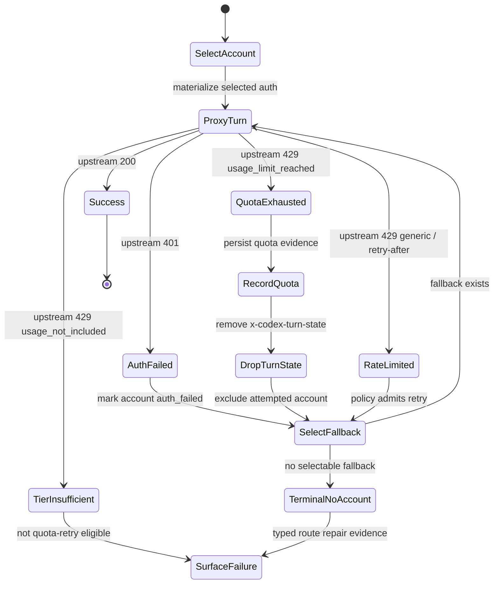
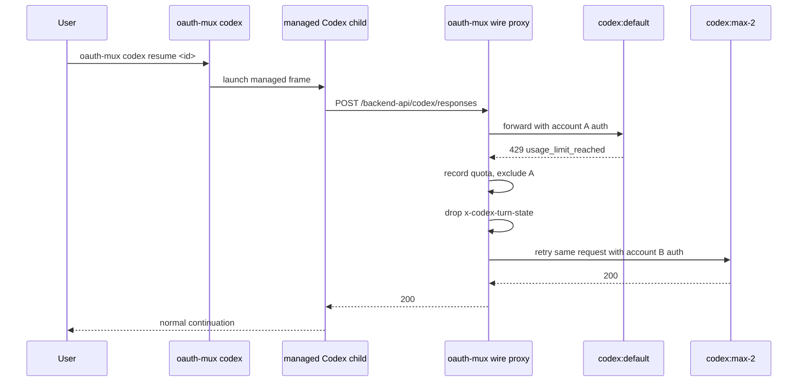

# Codex Live Quota Handoff Evidence
Date: 2026-05-09
Status: current evidence record; subordinate to
`docs/spec/broker-mcp-contract-2026-05-03.md`.

## Summary

The installed `oauth-mux codex resume <session-id>` path has now produced both
managed load/resume quota handoff evidence and an engineered managed-session
quota handoff artifact. The 2026-05-08 runs selected `codex:default`, observed
real `429 usage_limit_reached`, retried on `codex:max-2`, and received
`status:200`. The 2026-05-09 engineered window additionally shows
`codex:max-2` returning successful `200` responses before provider-originated
quota exhaustion, followed by a same-turn retry to `codex:max-3` and fallback
`status:200`.

This proves the managed Codex quota handoff shape for installed
`oauth-mux codex resume`. It still does not prove provider same-thread
continuity semantics across account boundaries or unmanaged bare-`codex`
daemon hot-swap.

## Evidence

Latest installed-runtime artifact:

- `<oauth-mux-state>/codex/status/managed-1778362718969.ndjson`
- Runtime identity: installed user-local `oauth-mux`, command spelling
  `oauth-mux codex`, no installed/local mismatch detected.
- Proxy evidence: successful `codex:max-2` `responses` turns before
  `status:429`, `classification:"quota_exhausted"`,
  `body_class:"usage_limit_reached"`, `delivered_to_codex:false`.
- Swap evidence: `proxy_post_swap_turn` and `proxy_same_turn_retry` from
  `codex:max-2` to `codex:max-3`, `dropped:"x-codex-turn-state"`.
- Fallback evidence: `proxy_turn` on `codex:max-3`,
  `method:"POST"`, `path_kind:"responses"`, `status:200`.
- Status oracle verdict:
  `verdict:"successful_live_quota_handoff"`,
  `provider_originated_live_fallback_claim:true`,
  `quota_handoff_observed:true`,
  `user_visible_failure_likely:false`.

Reviewed repo proof bundle:

- `docs/evidence/codex-engineered-quota-handoff-20260509/README.md`
- `docs/evidence/codex-engineered-quota-handoff-20260509/status-excerpt.ndjson`
- `docs/evidence/codex-engineered-quota-handoff-20260509/status-summary.json`

Prior installed-runtime artifact:

- `<oauth-mux-state>/codex/status/managed-1778273610565.ndjson`
- Runtime identity: installed user-local `oauth-mux`, command spelling
  `oauth-mux codex`, no installed/local mismatch detected.
- Selected account: `codex:default`.
- Quota evidence: `proxy_turn` on `codex:default`,
  `method:"POST"`, `path_kind:"responses"`, `status:429`,
  `classification:"quota_exhausted"`, `body_class:"usage_limit_reached"`,
  `delivered_to_codex:false`.
- Swap evidence: `proxy_post_swap_turn` and `proxy_same_turn_retry` from
  `codex:default` to `codex:max-2`, `dropped:"x-codex-turn-state"`.
- Fallback evidence: `proxy_turn` on `codex:max-2`,
  `method:"POST"`, `path_kind:"responses"`, `status:200`.
- Status oracle verdict:
  `verdict:"successful_live_quota_handoff"`,
  `provider_originated_live_fallback_claim:true`,
  `quota_handoff_observed:true`,
  `user_visible_failure_likely:false`.

Reviewed repo proof bundle:

- `docs/evidence/codex-managed-quota-handoff-20260508/README.md`
- `docs/evidence/codex-managed-quota-handoff-20260508/status-excerpt.ndjson`
- `docs/evidence/codex-managed-quota-handoff-20260508/status-summary.json`

Earlier installed-runtime artifact:

- `<oauth-mux-state>/codex/status/managed-1778271585359.ndjson`
- Same successful handoff shape, followed by additional successful
  `responses` turns on `codex:max-2`.

Historical failed artifact:

- `dist/live-qa/managed-resume-dogfood-9/status.ndjson`
- Dogfood-9 remains failure evidence: it proved managed auth continuity across
  selected-route `401 auth_unauthorized`, then later observed
  provider-originated `429 usage_limit_reached` on `codex:max-4` and failed
  with `NoAccountSelectable`.

## Claim Boundary

Proven:

- Installed bare command path, not a repo-local wrapper:
  `oauth-mux codex resume <session-id>`.
- Managed Codex process with mux-owned auth/config overlay and canonical
  session bridge.
- Provider-originated quota evidence on account A.
- Durable route-health observation before retry.
- Same-request retry to account B after dropping `x-codex-turn-state`.
- Successful fallback response on account B.
- No user-visible 429 in the successful handoff artifacts.

Not yet proven:

- Same-thread continuity semantics across account swap beyond the provider
  behavior already visible in the managed session.
- Mid-turn streaming recovery after partial response delivery.
- Bare unmanaged `codex` plus a separate background oauth-mux daemon
  hot-swapping account state.
- Non-Codex harness behavior.

## State Machine



## Handoff Flow



## Next Live Test Matrix

The next live work should be deliberate and budget-aware. Synthetic smokes are
still required, but they cannot replace these installed-runtime tests. The
operator checklist for the next proof lane is
`docs/spec/codex-live-acceptance-checklist-2026-05-08.md`.

| Scenario | Setup | Expected result | Acceptance value |
| --- | --- | --- | --- |
| Known exhausted login, credited fallback | `codex login` default account with known exhausted ChatGPT quota; one eligible credited fallback enrolled | Immediate managed load/resume handoff to fallback 200 | Already observed in the 2026-05-08 artifacts |
| Available account driven to exhaustion in session | Start managed session on credited account A; spend until provider returns `usage_limit_reached`; keep B credited | Same managed process retries to B and continues | Observed in the 2026-05-09 artifact |
| Exhausted account with extra API credits | Account has exhausted ChatGPT/Codex subscription quota but separate API credits | Subscription-backed Codex still reports subscription quota truth; API credits must not be mislabeled as Codex subscription capacity | Prevents dashboard/API-credit false positives |
| Exhausted subscription repaired by plan/quota reset | A was quota-exhausted; reset window expires or plan changes; no manual health reset | Broker plan marks revalidation needed, live revalidation repairs route only after provider evidence | Durable health repair proof |
| A exhausted, B tier insufficient, C credited | B returns `usage_not_included`; C is available | B is marked tier-insufficient, not quota; retry continues to C | Correct typed route-state sequencing |
| A exhausted, all fallbacks exhausted | Every candidate returns quota/rate/tier/auth rejection | Typed `quota_handoff_failed_no_account_selectable` with complete redacted rejection vector | Honest failure UX |
| Fallback access token expired but refreshable | B has expired access token and valid refresh token | Preflight refresh repairs B before selection or materialization | Prevents false `NoAccountSelectable` |

## Operator Guidance

- Keep using installed `oauth-mux`, not `./zig-out/bin/oauth-mux`, for live
  acceptance artifacts.
- Preserve redacted status artifacts before summarizing or citing them.
- Run:

```bash
python3 scripts/summarize-codex-status.py <status.ndjson> --require-brokered --require-fallback-sequence
```

- A closeable quota-handoff artifact should summarize as
  `successful_live_quota_handoff`.
- Do not close same-thread or unmanaged-daemon claims from the managed load
  handoff alone.
