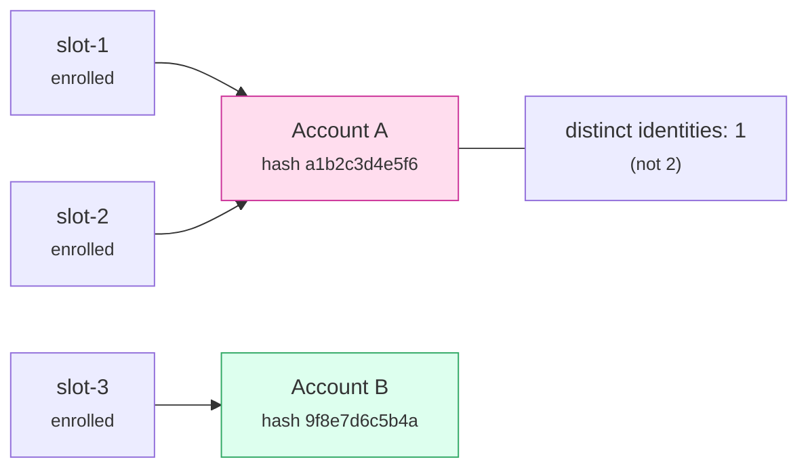
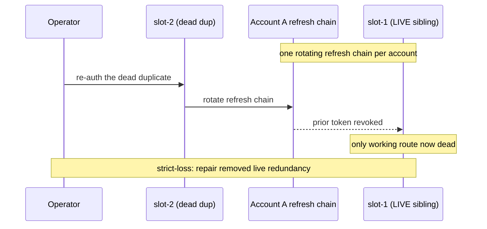
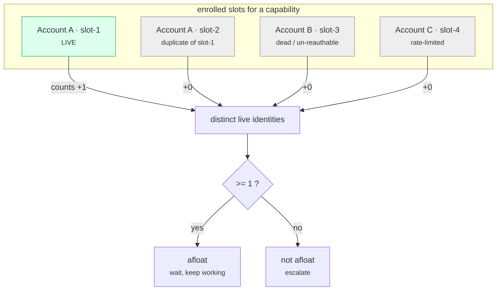

<!-- DRAFT for review. Drop into jesssullivan.github.io/src/posts/ and flip `published: true` to publish.
     TODO(optional): feature_image / thumbnail_image. Mermaid renders via the site's render-mermaid prebuild. -->

I build [oauth-mux](https://github.com/Jesssullivan/oauth-mux), a small account multiplexer that brokers my AI coding subscriptions (Codex CLI, Claude Code) so the editor in front of me never sees a dead token. It keeps each enrolled account's OAuth token warm and routes around the ones that go cold. The whole point is *never-halt*: one dead account must never stall work.

The design rests on an assumption I had never tested: more enrolled accounts means more redundancy. A live readout overturned it.

## Three slots, one identity

I had three accounts enrolled — call them `slot-1`, `slot-2`, `slot-3`. Two of them resolved to the *same underlying account*: identical account-id hash (a short hash of the provider's account-id claim, e.g. `a1b2c3d4e5f6`), identical masked email (`alice@example.com`). What looked like two redundant routes was one identity enrolled twice.

That is fake redundancy, and it gets worse. That identity could not be re-authed through the CLI — a step-up flow the CLI path mishandles, the kind of thing you hit with a hardware-security-key account behind an extra prompt. And OAuth uses a single rotating refresh chain per account. So "repairing" the dead duplicate by logging it in again would rotate the refresh token and **revoke the live sibling's token** — a strict-loss repair that would take out the only working copy of that identity. The intuitive fix was the failure.

The third slot was genuinely distinct, but only half-alive: its higher-tier capability was degraded (a 4xx) while its lower-tier capability stayed up. Redundancy is not even per-account. It is per-*capability*.

## The unit is a distinct live identity

The correction is one sentence: **count distinct live identities, not slots.** A duplicate enrollment, a dead account, and a rate-limited account each contribute *zero* to real redundancy depth. For a given capability, the system is afloat if and only if at least one distinct live identity remains.

If you measure slots, you will believe in failover you do not have. You will see "3" and feel safe while your true depth is 1 — and a routine repair can drop it to 0.

## What I built

A provider-agnostic **identity graph**. It began as pure analysis and is now also
used by keepalive admission: when two enrolled accounts share one OAuth identity,
the warm loop refuses to proactively refresh either member of that duplicate set,
because either refresh can rotate the same single-use refresh-token family. The
graph groups slots by an identity key and reports:

- **`distinctLiveIdentities`** and **`isAfloat`**, both capability-scoped. This is the never-halt predicate, the real depth.
- **`duplicateCollisions`** — auto-flags the same-identity-twice case I had been blind to, and now gates keepalive warm-pool admission.
- **`strictLossSlots`** — a dead slot whose re-auth would revoke a live same-identity sibling. The thing not to "fix."
- **`wouldRetireReduceRedundancy`** — a per-capability delta, so before retiring a slot I see exactly which capabilities survive it.

The identity key is a tagged union: the account-id hash when known, or a per-`(provider, account)` opaque key when it is not — so two *unknown* identities never collapse into each other.

That last point is the whole game. A stable **identity labeler** per provider hashes the server-issued, per-account id — for Claude Code that is the account UUID, **not** the per-install user id (too granular) and **not** the org UUID (too coarse; many accounts share one). Pick the wrong field and your identity graph is wrong in a way that looks right.

And it must **fail safe to "unknown" (null), never to a hash of the empty string.** Hashing `""` gives every unprofiled account the same key, silently coalescing all of them into one phantom identity — the exact bug the tool exists to catch, reintroduced at the labeler.

## The transferable part

I designed each piece with a tight research → design → adversarial-verify loop, and the verifier earned its keep before any code was written. It caught that the duplicate's re-auth was strict-loss, that strict-loss and retire-safety both had to be per-capability, and that the empty-string hash had to be impossible to emit.

None of this is specific to OAuth. Any failover system — replicas, DB connections, API keys, regions — has the same trap. If two "redundant" units share a single point of failure, you have one unit wearing two name tags. The fixes generalize:

1. Define the identity that actually fails, and key on the server's notion of it, not your local handle.
2. Make true depth — distinct live units per capability — a visible number.
3. Before any repair, ask whether it is strict-loss against a live sibling.
4. Never let an unknown identity coalesce. Fail open to *distinct*, not to *same*.

Redundancy you cannot count is redundancy you do not have.
